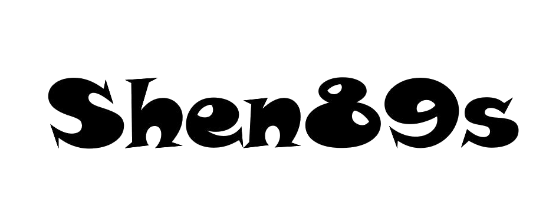

# 大话(**^▽^**)测试

> <small>你把时间</small> 浪费 <small>在哪里 那里就会</small><em> 开花结果 </em>

- Unit Test、Integration Test、System Test 、User Acceptance Test、API Test

[Mail](mailto:shenjb@thunisoft.com)
[Gitee](http://shen89s.gitee.io)
[Get Started](#软件测试简史)

