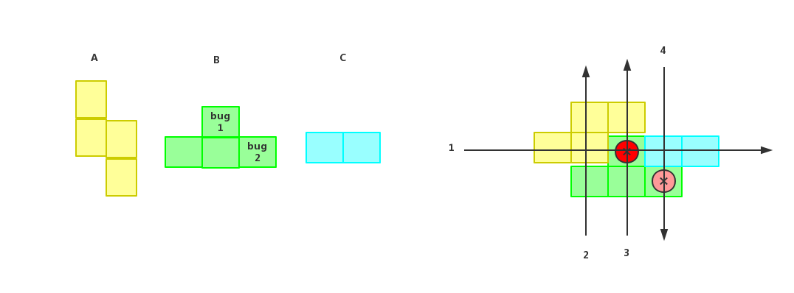

## 缺陷优先级定义

缺陷的修复优先级是指缺陷在修复过程中被处理的先后顺序。划分缺陷优先级的目的在于指导开发人员更加有效的修复缺陷，这种有效不仅体现在解决速度上，更加有从软件质量角度的上考虑。作为测试人员除了不亲自上手修复缺陷以外，应该尽可能的指导开发人员加快缺陷的修复进度，如：明确缺陷必现步骤、缺陷定位分析、划分缺陷优先级等等，其中划分缺陷优先级就是一项很重要的工作。

## 缺陷优先级划分

#### 造成测试阻塞的缺陷优先级应该更高

举个例子，假如我们在做一个系统的ABC三个模块的功能集成测试，如图我们有4条集成测试用例，假设我们已知B模块存在bug1和bug2，那么在执行测试用例时，所有经过bug所在模块的用例执行结果都会是失败，如图所示用例1、用例3、用例4的执行结果都会失败。用例1的测试没有执行到代码C中，用例3的测试没有执行到代码A中，这时我们可以称用例1和用例3被bug1阻塞了，和测试用例4执行结果为失败是不同的，用例1和用3执行存在阻塞，这种阻塞体现了一种未知性：我们并不知道这些用例最后的执行结果是什么，意味着测试内容并没有顺利的执行完。

我们在来分析一下bug1和bug2，假设对于用户来说，bug1的严重程度是一般，bug2的严重程度为严重，此时开发人员资源只允许我们修复1个缺陷，我们应该优先修复那个缺陷呢？我们应该优先修复bug1，这是因为bug2只有到了产品发布阶段才会造成严重的用户影响，而bug1如果不修复，那么下个build版本用例1和用例3还是不能执行，对于测试来说应该在本build版本中完成的测试内容依然还没完成，这影响了测试工作的继续，一个优秀团队里的成员，不会只顾自己的工作，而把未知和压力抛到后期或队友，正确的协作才是一个团队的灵魂。

#### 影响缺陷优先级的其他因素

口  缺陷修复改动越大，越需要尽早解决。 
口  涉及需求、方案、设计的修改，需要尽早解决。 
口  缺陷严重级别为“致命”和“严重”的缺陷，需要尽早解决。 

## 划分优先级示例

举个列子，假如我们在某一个build版本中一共发现14个缺陷，情况如下表：
<table>
	<tr>
		<th width="125px" align="left">缺陷ID</th>
		<th width="125px" align="left">是否阻塞</th>
		<th width="125px" align="left">严重级别</th>
		<th width="125px" align="left">修复改动</th>
		<th width="125px" align="left">缺陷ID</th>
		<th width="125px" align="left">是否阻塞</th>
		<th width="125px" align="left">严重级别</th>
		<th width="125px" align="left">修复改动</th>
	</tr>
	<tr>
		<td>缺陷1</td>
		<td>是</td>
		<td>一般</td>
		<td>改动一般</td>
		<td>缺陷8</td>
		<td>否</td>
		<td>严重</td>
		<td>改动复杂</td>
	</tr>
	<tr>
		<td>缺陷2</td>
		<td>否</td>
		<td>致命</td>
		<td>改动一般</td>
		<td>缺陷9</td>
		<td>否</td>
		<td>严重</td>
		<td>涉及需求</td>
	</tr>
	<tr>
		<td>缺陷3</td>
		<td>是</td>
		<td>一般</td>
		<td>改动一般</td>
		<td>缺陷10</td>
		<td>否</td>
		<td>一般</td>
		<td>改动一般</td>
	</tr>
	<tr>
		<td>缺陷4</td>
		<td>是</td>
		<td>严重</td>
		<td>改动复杂</td>
		<td>缺陷11</td>
		<td>否</td>
		<td>一般</td>
		<td>改动复杂</td>
	</tr>
	<tr>
		<td>缺陷5</td>
		<td>否</td>
		<td>致命</td>
		<td>改动一般</td>
		<td>缺陷12</td>
		<td>否</td>
		<td>一般</td>
		<td>改动复杂</td>
	</tr>
	<tr>
		<td>缺陷6</td>
		<td>否</td>
		<td>致命</td>
		<td>改动复杂</td>
		<td>缺陷13</td>
		<td>否</td>
		<td>提示</td>
		<td>改动一般</td>
	</tr>
	<tr>
		<td>缺陷7</td>
		<td>否</td>
		<td>严重</td>
		<td>改动一般</td>
		<td>缺陷14</td>
		<td>否</td>
		<td>提示</td>
		<td>改动一般</td>
	</tr>
</table>
我们假设在本版本中，开发人员有能力修复8个缺陷，那么其中缺陷1、缺陷3、缺陷4会造成测试阻塞，为必须解决。剩下的缺陷，我们根据缺陷的严重级别、改动大小情况来排序，分析选取过程我们可以按照如下方式选取： 
口  对测试阻塞必须解决的缺陷-缺陷1、缺陷3、缺陷4 
口  缺陷严重级别非常高，缺陷改动大(复杂/涉及需求)-缺陷6 
口  缺陷严重级别非常高，缺陷改动一般-缺陷2、缺陷5 
口  缺陷严重级别高，缺陷改动大(复杂/涉及需求)-缺陷8、缺陷9 
口  缺陷严重级别高，缺陷改动一般-缺陷7 
口  缺陷严重级一般，缺陷改动大(复杂/涉及需求)-缺陷11、缺陷12 
口  缺陷严重级一般，缺陷改动一般-缺陷10 
口  其他-缺陷13、缺陷14 

按照选取顺序我们又选择了缺陷2、缺陷5、缺陷6、缺陷8、缺陷9，组成了最后我们本版本需要解决的缺陷是：缺陷1、缺陷2、缺陷3、缺陷4、缺陷5、缺陷6、缺陷8、缺陷9。需要注意的时，即使都是本版本中需要解决的缺陷，也需要注意优先级：缺陷1、缺陷3、缺陷4、缺陷6、缺陷2、缺陷5、缺陷8、缺陷9。

## 小结

需要我们测试人员铭记的是，修复对测试有阻塞的缺陷优先级应该更高，与修复普通严重级别的缺陷以及开发新功能相比，“测试阻塞”意味着测试人员并没有完成本应该完成的工作，被阻塞的部分功能质量是未知的。如果放任不管而继续开发新功能，会大大增加集成时的风险。因此我们通常在提缺陷的时候除了标注严重级别意外，还有标注优先级，严重级别一旦达成一致以后不再改变，而优先级通常会随着缺陷的修复情况随时调整，从而达到指导开发人员修复缺陷的顺序。 
注：有的公司和团队在缺陷修改优先级上，把阻塞的缺陷严重级别定义为严重，以达到优先修复的目的，针对这点，建议将缺陷严重级别和修复优先级做一下区分，毕竟测试人员还有很多缺陷分析工作，这会导致缺陷统计和分类等不准确。

* * *
:bell:A1811-一个优秀团队里，成员不会只顾自己的工作，而把未知和压力抛到后期或队友，正确的协作才是一个团队的灵魂。
