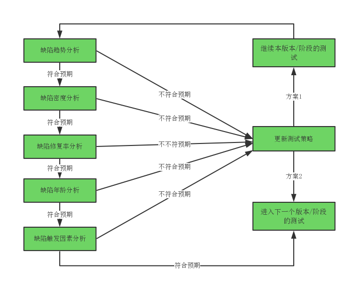

#  组合缺陷分析技术

## 概念&意义
缺陷分析技术，到目前为止我们已经介绍了5种，每一种缺陷分析技术，都能够从某些方面来对产品质量进行评估。但是我们进行缺陷分析，并不满足只对产品质量的某一方面进行评估，这就需要我们组合使用这些缺陷分析技术，多方面的评估产品整体质量。

<table>
	<tr>
		<th width="300x" align="left">缺缺陷分析技术</th>
		<th width="700x" align="left">测试质量评估项</th>
	</tr>
	<tr>
		<td rowspan="2">缺陷密度分析</td>
		<td>预测产品总计会有多少缺陷。</td>
	</tr>
	<tr>
		<td>评估当前发现的缺陷总数是否足够多。</td>
	</tr>
	<tr>
		<td>缺陷修复率分析</td>
		<td>已发现的缺陷是否已经被有效的修复。</td>
	</tr>
	<tr>
		<td>缺陷趋势分析</td>
		<td>系统是否还能被继续有效的发现缺陷。</td>
	</tr>
	<tr>
		<td>缺陷年龄分析</td>
		<td>各环节可能引入的缺陷，是否已经被有效的去除。</td>
	</tr>
	<tr>
		<td>缺陷触发因素分析</td>
		<td>测试(测试方法)是否已经足够全面。</td>
	</tr>
</table>

## 方法和思路
在一个产品测试中，使用组合缺陷分析技术评估产品质量思路如下示意。需要注意的是，缺陷分析应该在项目测试过程中持续进行，即每个测试版本、每个测试分层和阶段以及在发布时，都需要进行缺陷分析。

* * *

:bug: A1812-勇敢，是临危不惧；怀念过去不如憧憬未来。
