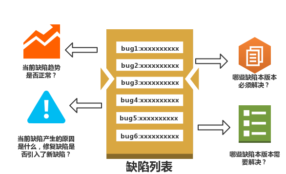

# 每日缺陷跟踪

每日缺陷跟踪见名知意，就是关注和处理每天发现的缺陷，是测试人员日常工作内容之一。通常我们在每日缺陷跟踪时需要重点关注以下这几个问题： 
口  当前缺陷趋势是否正常？ 
口  当前缺陷是否完成了定位分析？ 
口  当前缺陷是否必须在本版本中解决？ 
口  当前缺陷是否需要在本版本中解决？ 

这些问题或问题的解决程度会影响到后续测试的执行，测试人员需要实时关注和反馈，软件测试架构师可能也需要因此来调整测试策略。

### 1.当前缺陷趋势是否正常

[缺陷趋势分析技术](books/缺陷趋势分析.md)能够帮助我们分析缺陷是否收敛，其中在讨论理想的累积发现缺陷趋势图时，我们是以测试阶段为单位来分析的，但实际上，每个测试阶段都会包含一个或者多个版本，一个版本又有可能需要测试若干天，因此根据测试时间和测试进度就可以预估拐点的出现位置，判定趋势是否正常。

我们先来回顾一下“拐点”的意义：
测试策略不变的情况下，出现拐点，说明当前测试已经不能有效的发现系统的缺陷，当前测试可以按照计划结束，进入下一阶段的测试。
测试策略不变说明测试对象和测试方法没有发生变化，我们可以可以理解为: 
口  测试策略中测试方法不同(同一个测试对象)，就不有应该出现拐点。 
口  测试策略中测试对象不同（同样的测试方法），也不应该出现拐点。 

按照以上原则，我们结合自己产品测试流程，要想知道当前的缺陷趋势是否正常，就必须清楚当前测试策略下完整的测试流程缺陷趋势是怎样的，做到能够预估理想情况下的缺陷趋势图，能够预计符合预期的趋势图中各拐点出现的位置，以及能够分析趋势图上的拐点是否符合我们的策略和预期，结合当前测试所处的阶段和具体测试情况，就能很容易的判断当前的缺陷趋势是否正常。

在分析的过程中我们可以结合[缺陷趋势分析技术](books/缺陷趋势分析.md)中的方法，将判定缺陷趋势是否正常简化为“判定拐点的出现是否过早或过晚”，以及按照其中的方法调整测试策略来应对和纠正缺陷趋势。

举个例子，以下是一个简化的gitflow模式下的测试流程：

口  Feature阶段，Build1后期，由于测试方法和测试对象未发送变化会，凹转凸会出现第一个拐点。 
口  Feature阶段，Build2版本由于测试方法不同，会再次触发新一轮缺陷，凸转凹出现第二个拐点。 
口  Feature阶段，阶段测试后期，会像Build1后期一样,凹转凸出现第三个拐点。 
口  DEV阶段,Build3开始集成测试，由于测试内容、测试方法的不同，很快会出现凸转凹出现第四个拐点。 
口  DEV阶段,Build3~Build4有新功能合入，由于不断集成系统会越来越复杂，测试方法从单功能测试逐步转化为单功能测试+多功能测试，凹性持续不会出现拐点。 
口  DEV阶段,Build5是一个回归测试版本，测试方法相比也没有发生变化，会凹转凸出现一个拐点。 
口  Release阶段，Build6虽然也是功能回归测试，但集成测试和系统测试是有区别的，如系统的复杂度、硬件外设等，会凸转凹出现一个拐点。 
口  Release阶段，Build6后期由于测试方法不变，很快会凹转凸出现一个拐点。 
口  Release阶段，Build7测试方法会发生变化，所以会凸转凹出现拐点。 
口  Release阶段，Build7后期由于测试方法不变，很快会凹转凸出现一个拐点。 
口  Release阶段，Build8是探索式测试，相比测试方法不同，所以他们之间会凸转凹出现一个拐点。 
口  最后一个拐点应该在Build8后期出现比较合适。 

注释：分阶段的测试趋势图无论拐点出现和预期符合度如何，整体缺陷趋势应该有明显的变缓。

### 2.当前缺陷是否完成了定位分析

针对已发现的缺陷进行定位分析，是测试人员重要的工作之一。 
口  明确缺陷复现步骤，如缺陷必现最小路径。 
口  明确缺陷产生的原因和影响范围，如缺陷会造成业务数据不完整或垃圾数据。 
口  明确开发人员修复缺陷修改内容，如是否修改业务通用类、基础算法类等等。 
口  明确缺陷产生的具体原因，如设计编码逻辑问题、修复缺陷产生的新缺陷等。 

针对最后一点如果发现有缺陷是因为缺陷修复而引入的，这说明当前缺陷修复质量不高，缺陷定位时对影响范围把握不准确，回归范围不准确或有遗漏。 
对于测试人员来说，可以采取以下措施： 
口  验证完缺陷以后，围绕缺陷展开探索式测试。 
口  增加开发人员和测试人员对修改内容、影响范围等的沟通，尤其针对重点修改或者较大改动的缺陷。 
口  增加约定一些有利于缺陷修改质量的措施，如对缺陷的代码进行review后才能合入，每修改的缺陷开发人员都需要提供自检报告单等等。 
口  增大对基本功能进行回归测试的比例。 
 缺陷修改引入缺陷还会带来另外一个影响，就是会造成缺陷趋势不会收敛。因此我们可以通过控制提高缺陷修复质量，来促进缺陷的快速收敛，也可以通过缺陷不收敛而反向印证是否存在大量的新缺陷是因为修改缺陷引入的。

### 3.当前缺陷是否必须在本版本中解决

一般我们在进行测试规划的时候，都会规划测试版本。如进行几轮测试，每轮测试规划几个版本，每个版本的测试重点测试策略是什么,以及每个版本规划解决那些缺陷等等 判定缺陷是否必须在本版本中解决的标准只有一个，那就是“会不会对后续测试造成阻塞”。

需要注意不要和[“缺陷的严重级别”](books/测试基础定义-缺陷严重级别定义.md)混淆。缺陷的严重级别是指缺陷如果不修复，会对用户造成的影响。我们通常认为缺陷的严重程度越高，修复它的优先级就应该越高，这一点没问题，但是严重或致命的缺陷，却不一定会让测试用例执行发生“阻塞”。

举个例子，假如我们在做一个系统的ABC三个模块的功能集成测试，如图我们会有4条测试用例，假设我们已知B模块存在bug1和bug2，那么在执行测试用例时，所有经过bug所在方块的用例执行结果都会是失败，如图所示用例1、用例3、用例4的执行结果都会失败。用例1的测试没有执行到代码C中，用例3的测试没有执行到代码A中，这时我们可以称用例1和用例3被bug1阻塞了，和测试用例4执行结果为失败是不同的，用例1和用3执行存在阻塞，这种阻塞体现了一种未知性：我们并不知道这些用例最后的执行结果是什么，意味着测试内容并没有顺利的执行完。

我们在来分析一下bug1和bug2，假设对于用户来说，bug1的严重程度是一般，bug2的严重程度为严重，此时资源只允许我们修复1个缺陷，我们应该优先修复那个缺陷呢？我们应该优先修复bug1，这是因为bug2只有到了产品发布阶段才会造成严重的用户影响，而bug1如果不修复，那么下个版本用例1和用例3还是不能执行，对于测试来说本版本测试内容依然还没完成，影响了测试工作的继续，一个优秀团队里的成员，不会只顾自己的工作，而把未知和压力抛到后期或队友，正确的协作才是一个团队的灵魂。

需要我们测试人员铭记的是，相比修复普通严重缺陷以及开发新功能，修复对测试有阻塞的缺陷优先级应该更高。“测试阻塞”意味着测试并没有完成本版本的功能的严重，被阻塞的部分功能质量是未知的。如果放任不管而继续开发新功能，会大大增加集成时的风险。因此我们通常在提缺陷的时候除了标注严重级别意外，还有标注优先级，严重级别一旦达成一致以后不再改变，而优先级通常会随着缺陷的修复情况随时调整，从而达到指导开发人员修复缺陷的顺序。 
注：有的公司和团队在缺陷修改优先级上，把阻塞的缺陷严重级别定义为严重，以达到优先修复的目的，针对这点，建议将缺陷严重级别和修复优先级做一下区分，毕竟测试人员还有很多缺陷分析工作，这会导致缺陷统计和分类等不准确。

### 4.当前缺陷是否需要在本版本中解决

需要在本版本中解决的缺陷是指我们希望在本版本中修复的缺陷。 

显然本版本中需要解决的缺陷，包含上一小节讨论的本版本中必须解决的缺陷。换句话说，除了那些在本版本中必须解决的缺陷，我们还需要根据缺陷的严重级别和缺陷的修复情况再选择一些缺陷，在开发资源允许的情况下在本版本中优先解决。 

作为测试人员除了不亲自上手修复缺陷以外，应该尽可能的指导开发人员加快缺陷的修复进度，其中指导开发进行正确的修复顺序就是一项很重要的工作。 

注：当然如果开发人员的修复能力以不足以解决本版本中必须解决的缺陷，例如团队中的部分资源被借调了等等，那么这项工作也就可以不开展了，但通常一个相对成熟稳定的团队，开发和测试比合理的情况下，这项工作还是常常需要做的。 还存在一种极端的情况：当开发人员的修复能力不足以解决本版本中必须解决的缺陷时，说明按照当前的计划测试质量问题得不到有效解决，需要调整测试计划，放慢测试版本构建，梳理“本版本中需要解决的缺陷”，指导和辅助开发人员修复缺陷的顺序，也可以加快缺陷修复的进度。

本版本中需要优先解决的缺陷，一般具备以下因素： 
口  缺陷解决改动越大，越需要尽早解决。 
口  涉及需求、方案、设计的修改，需要尽早解决。 
口  缺陷严重级别为“致命”和“严重”的缺陷，需要尽早解决。 

举个列子，假如我们在某一个build版本中一共发现14个缺陷，情况如下表： 
<table>
	<tr>
		<th>缺陷ID</th>
		<th>是否阻塞</th>
		<th>严重级别</th>
		<th>修复改动</th>
		<th>缺陷ID</th>
		<th>是否阻塞</th>
		<th>严重级别</th>
		<th>修复改动</th>
	</tr>
	<tr>
		<td>缺陷1</td>
		<td>是</td>
		<td>一般</td>
		<td>改动一般</td>
		<td>缺陷8</td>
		<td>否</td>
		<td>严重</td>
		<td>改动复杂</td>
	</tr>
	<tr>
		<td>缺陷2</td>
		<td>否</td>
		<td>致命</td>
		<td>改动一般</td>
		<td>缺陷9</td>
		<td>否</td>
		<td>严重</td>
		<td>涉及需求</td>
	</tr>
	<tr>
		<td>缺陷3</td>
		<td>是</td>
		<td>一般</td>
		<td>改动一般</td>
		<td>缺陷10</td>
		<td>否</td>
		<td>一般</td>
		<td>改动一般</td>
	</tr>
	<tr>
		<td>缺陷4</td>
		<td>是</td>
		<td>严重</td>
		<td>改动复杂</td>
		<td>缺陷11</td>
		<td>否</td>
		<td>一般</td>
		<td>改动复杂</td>
	</tr>
	<tr>
		<td>缺陷5</td>
		<td>否</td>
		<td>致命</td>
		<td>改动一般</td>
		<td>缺陷12</td>
		<td>否</td>
		<td>一般</td>
		<td>改动复杂</td>
	</tr>
	<tr>
		<td>缺陷6</td>
		<td>否</td>
		<td>致命</td>
		<td>改动复杂</td>
		<td>缺陷13</td>
		<td>否</td>
		<td>提示</td>
		<td>改动一般</td>
	</tr>
	<tr>
		<td>缺陷7</td>
		<td>否</td>
		<td>严重</td>
		<td>改动一般</td>
		<td>缺陷14</td>
		<td>否</td>
		<td>提示</td>
		<td>改动一般</td>
	</tr>
</table>

我们假设在本版本中，开发人员有能力修复8个缺陷，那么其中缺陷1、缺陷3、缺陷4会造成测试阻塞，为必须解决。剩下的缺陷，我们根据缺陷的严重级别、改动大小情况来排序，分析选取过程我们可以按照如下方式选取： 
口  对测试阻塞必须解决的缺陷-缺陷1、缺陷3、缺陷4 
口  缺陷严重级别非常高，缺陷改动大(复杂/涉及需求)-缺陷6 
口  缺陷严重级别非常高，缺陷改动一般-缺陷2、缺陷5 
口  缺陷严重级别高，缺陷改动大(复杂/涉及需求)-缺陷8、缺陷9 
口  缺陷严重级别高，缺陷改动一般-缺陷7 
口  缺陷严重级一般，缺陷改动大(复杂/涉及需求)-缺陷11、缺陷12 
口  缺陷严重级一般，缺陷改动一般-缺陷10 
口  其他-缺陷13、缺陷14 

按照选取顺序我们又选择了缺陷2、缺陷5、缺陷6、缺陷8、缺陷9，组成了最后我们本版本需要解决的缺陷是：缺陷1、缺陷2、缺陷3、缺陷4、缺陷5、缺陷6、缺陷8、缺陷9。需要注意的时，即使都是本版本中需要解决的缺陷，也需要注意优先级：缺陷1、缺陷3、缺陷4、缺陷6、缺陷2、缺陷5、缺陷8、缺陷9。

* * *
:bell: A1812-一个优秀团队里的成员，不会只顾自己的工作，而把未知和压力抛到后期或队友，正确的协作才是一个团队的灵魂。
