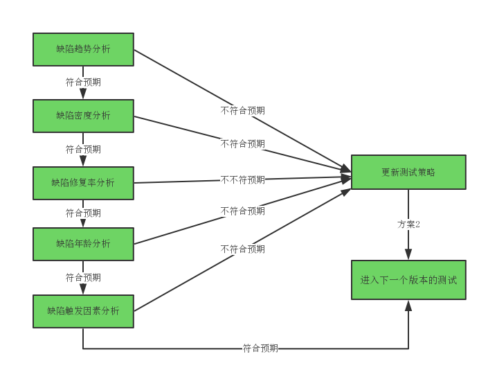

# 版本缺陷分析

版本缺陷分析的含义是指以测试版本为单位对发现的缺陷进行分析，即分析那些在执行各版本规划的测试内容时发现的缺陷。
版本缺陷分析我们使用组合缺陷分析技术进行分析，通过分析结果确定更新策略，然后进行下一版本的测试。版本缺陷分析的目的是通过更新测试策略，在下个版本测试时解决当前版本的问题。如通过重新review需求解决缺陷年龄分析-需求缺陷问题，调整测试方法补充测试用例解决缺陷密度偏低问题等。

 CLICK ME 了解分析过程

### 1.版本缺陷密度分析
通过[缺陷分析技术之缺陷密度分析](books/缺陷密度分析.md)，我们知道了缺陷密度是对系统中可能包含多少缺陷的预估，这可以帮助我们评估当前系统已经发现的缺陷数是否足够多。为了达到最终对系统缺陷情况进行评估的效果，通常在每个版本结束的时候对每个功能特性发现的缺陷密度进行统计和分析。 
然后，我们可以根据功能特性的优先级、测试投入等来分析功能特性的缺陷密度是否合理，如果发现不合理的地方，需要对根因进行分析，判定是否需要更新测试策略，确认应对和改进措施。 

随着版本测试执行的进行，我们还需要分析判断实际缺陷密度是否在可以接受的范围内，是否需要更新质量目标，当我们发现实际的缺陷密度和目标出现较大的偏差时，可以按照[缺陷密度分析](books/缺陷密度分析.md)中介绍的方法来进行处理。 
注：这里的功能特性可以理解，发布版本里规划的需求。如下表：

<table>
	<tr>
		<th>版本</th>
		<th>功能</th>
		<th>代码</th>
		<th>缺陷</th>
		<th>实际密度</th>
		<th>预估密度</th>
		<th>处理措施</th>
	</tr>
	<tr>
		<td rowspan="3">Build1</td>
		<td>特性A</td>
		<td>10千行</td>
		<td>6个</td>
		<td>0.6</td>
		<td>0.8</td>
		<td>缺陷密度偏低，增加测试投入</td>
	</tr>
	<tr>
		<td>特性B</td>
		<td>10千行</td>
		<td>7个</td>
		<td>0.7</td>
		<td>0.8</td>
		<td>缺陷密度偏低，提高测试能力</td>
	</tr>
	<tr>
		<td>特性C</td>
		<td>10千行</td>
		<td>8个</td>
		<td>0.8</td>
		<td>0.8</td>
		<td>缺陷密度合理，测试策略不变</td>
	</tr>
	<tr>
		<td >...</td>
		<td colspan="6">...</td>
	</tr>
	<tr>
		<td rowspan="3">Build5</td>
		<td>特性A</td>
		<td>10千行</td>
		<td>9个</td>
		<td>0.9</td>
		<td>0.8</td>
		<td>密度偏高，产品质量较差，提高预估值</td>
	</tr>
	<tr>
		<td>特性B</td>
		<td>10千行</td>
		<td>10个</td>
		<td>1.0</td>
		<td>0.8</td>
		<td>提高预估值，增加测试投入</td>
	</tr>
	<tr>
		<td>特性C</td>
		<td>10千行</td>
		<td>11个</td>
		<td>1.1</td>
		<td>0.8</td>
		<td>提高预估值，加强评审</td>
	</tr>
</table>

###  2.版本缺陷年龄分析

我们可以通过[缺陷年龄分析](books/缺陷分析技术-缺陷年龄分析.md)中介绍的年龄分析步骤，来进行版本缺陷年龄分析。 
口 第一步：确定缺陷年龄。 
口 第二步：按照缺陷年龄分类，统计缺陷数量，绘制缺陷年龄分布图。 
口 第三步：按照分布图，对缺陷的年龄进行分析。 

<table>
	<tr>
		<th>版本</th>
		<th>年龄</th>
		<th>数量</th>
		<th>...</th>
		<th>版本</th>
		<th>年龄</th>
		<th>数量</th>
		<th>处理措施</th>
	</tr>
	<tr>
		<td rowspan="6">Build1</td>
		<td>历史遗留</td>
		<td>10</td>
		<td rowspan="6">...</td>
		<td rowspan="6">Build5</td>
		<td>历史遗留</td>
		<td>20</td>
		<td>老功能分析，探索式测试</td>
	</tr>
	<tr>
		<td>需求阶段</td>
		<td>10</td>
		<td>需求阶段</td>
		<td>20</td>
		<td>需求review，需求澄清</td>
	</tr>
	<tr>
		<td>设计阶段</td>
		<td>10</td>
		<td>设计阶段</td>
		<td>20</td>
		<td>设计review，设计评审</td>
	</tr>
	<tr>
		<td>编码阶段</td>
		<td>10</td>
		<td>编码阶段</td>
		<td>20</td>
		<td>编码review，代码评审</td>
	</tr>
	<tr>
		<td>需求变更</td>
		<td>10</td>
		<td>需求变更</td>
		<td>20</td>
		<td>控制变更范围，澄清变更内容</td>
	</tr>
	<tr>
		<td>缺陷修复</td>
		<td>10</td>
		<td>缺陷修复</td>
		<td>20</td>
		<td>分析缺陷原因，回归影响范围</td>
	</tr>
</table>

在进行版本缺陷年龄分析时，我们的期望是： 
口 缺陷都能在引入阶段就能及时发现该类缺陷，且缺陷不会遗漏到下个阶段。 
口 在特定的测试分层/阶段发现该层的缺陷，如集成和系统测试阶段发现的缺陷主要是编码和设计阶段的缺陷和对接的问题。 
口 没有继承或历史遗留引入的缺陷。 
口 没有需求变更引入的缺陷。 
口 没有修改缺陷引入新缺陷。 

总之，当我们分析结果不符合预期时，都可以参考[缺陷年龄分析](books/缺陷分析技术-缺陷年龄分析.md)中介绍的方法进行处理。

###  3.版本缺陷触发因素法分析

我们可以通过[缺陷触发因素分析](books/缺陷分析技术-缺陷触发因素分析.md)中介绍的缺陷触发因素分析步骤和处理方法，来进行版本缺陷触发因素分析。 
口 第一步：确定缺陷的测试方法和测试类型。 
口 第二步：按照测试方法分类，统计缺陷梳理，绘制缺陷触发因素分布图。 
口 第三步：按照分布图，对缺陷的触发因素进行分析。 

###  4.版本缺陷修复率分析

每日缺陷跟踪中我们对缺陷需要在那个版本中解决进行了分析，那么版本缺陷修复率分析就是在检查版本缺陷修复率是否达标。我们可以通过[缺陷修复率分析](books/缺陷分析技术-缺陷修复率分析.md)中介绍的方法细化出版本缺陷修复率指标，修复率不达标需要继续本版本测试。

###  5.版本缺陷趋势分析

针对每日缺陷跟踪中分析过的内容，在进行版本缺陷分析的时候，我们只进行简单的总结回顾即可。

* * *
:bell:A1812-到了现在还会学习和努力，不是做给谁看也不再是为了感谢亲人，而仅仅是为了多挣一点钱，多赋一些能力，争夺选择权。
