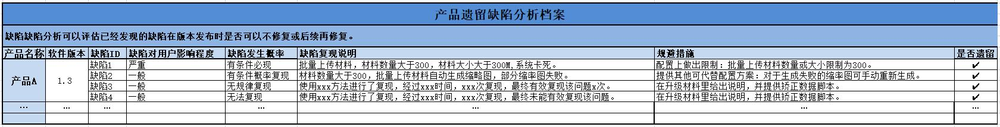

# 遗留缺陷分析

## 概念&内容

遗留缺陷分析是指分析那些在版本发布时不准备修复的缺陷。遗留缺陷分析最好在发布前的几个版本就开始进行，这是因为遗留缺陷需要项目中所有参与人员都达成一致，如产品/需求人员、研发人员、测试人员、市场服务人员等等。不同岗位的人员角度不同、意见不同是很正常的，沟通交流、协调缺陷的修改都需要时间。进行遗留缺陷分析需要参与的人有主要包括： 
口 产品和需求人员，面向客户调研需求的人员。 
口 研发人员，很多公司研发经理直接面向交付。 
口 测试人员，发现缺陷的直接干系人。 
口 市场服务人员，驻地、服务客户人员。 

## 分析步骤

进行遗留缺陷分析需要考虑的主要内容包括: 
口 缺陷对用户的影响程度。 
口 缺陷发生的概率或频率。 
口 缺陷风险评估和规避措施。 

 CLICK ME 了解分析过程

#### 1.明确 缺陷对用户的影响程度

明确缺陷对用户的影响程度是判定缺陷是否可以遗留的直接依据。缺陷对用户的影响程度是指缺陷在用户环境发生后会对用户造成怎样的影响。缺陷对用户的影响程度可以使用问题的[严重级别来定义](books/测试基础定义-缺陷严重级别定义.md)。

#### 2.明确 缺陷发生的概率

缺陷发生的概率是指缺陷在用户环境中发生的概率，不过在实际项目中，缺陷发生的概率往往是缺陷在测试环境中出现的概率。很多人错误的认为缺陷的发生概率越高严重级别就越高，初一看好像很有道理，其实不然，这是完全不同的两个概念。
	<table>
		<tr>
			<th>缺陷发生概率</th>
			<th>定义&描述</th>
		</tr>
		<tr>
			<td>有条件必现</td>
			<td>缺陷在测试环境中，按照特定的步骤，每次都能必然复现。</td>
		</tr>
		<tr>
			<td>有条件概率复现</td>
			<td>缺陷在测试环境中，不会每次都复现，但按照特定的操作步骤出现的概率很大。</td>
		</tr>
		<tr>
			<td>无规律复现</td>
			<td>测试人员无法明确缺陷复现的步骤，但缺陷可以在测试环境中无规律出现。</td>
		</tr>
		<tr>
			<td>无法复现</td>
			<td>测试人员无法明确缺陷复现的步骤，且缺陷已无再出现。</td>
		</tr>
	</table>

#### 3.明确 缺陷风险和规避措施

判断缺陷是否可以遗留，其实就是对缺陷进行风险评估。我们可以使用[风险评估方法](books/风险分析技术-概述.md)，来初步筛选出哪些缺陷可以遗留。对那些初步确认是可以遗留的缺陷，需要制订缺陷的规避措施-所谓规避措施，其实就是指一种风险应对措施，如果最终没有合适的规避措施，那么缺陷也就不可以遗留。下面是一些可供参考的思路： 
口 系统提供了其他可替代的功能。 
口 系统在配置上给出限制，避免用户触发bug 
口 系统给出了明确的提示(包括资料手册等)。 

原则上，满足下述条件的缺陷不应该成为遗留缺陷： 
口 “致命”缺陷不应该作为遗留缺陷。 
口 没有“规避措施”的“严重缺陷”不应该遗留。 

## 建立产品遗留缺陷分析档案

我们用一张表来记录遗留缺陷，通常也作为遗留缺陷讨论和发布时的补充材料。需要特别注意的是，对“无规律复现”和“无法复现”的缺陷，需要给出“复现说明”，说明复现过程，如使用了怎样的方法、复现了多少次、复现了多长时间等等。

 CLICK ME 了解其他发布注意事项

### 1.临近发布时的缺陷修复策略

我们在确定遗留缺陷的过程中,一方面,由于不同人员对缺陷遗留的标准可能会有差别,难免又会临时决定要修改合入一些缺陷。另一方面,越到临近发布的时候,越需要控制缺陷修复的数量。以免引入更严重的问题得不偿失。

### 2.非必然重现bug的处理方式

在进行遗留缺陷分析时,我们讨论了缺陷发生的概率,对那些非必然重现的bug(指“无规律重现”和“无法重现”的bug),也需要定期进行跟踪和处理。
在实际项目中,我们常常发现一些开发人员和测试人员对非必然重现bug的处理存在问题,如： 
口 一些开发人员认为问题不能复现,即使测试提交了bug也无法修改,提出来也没用,需要测试人员找到复现的条件后才能提bug。 
口 一些测试人员遇到非必然重现问题时,认为出现概率很小,可以不提bug。 
口 一些开发人员认为非必然重现问题如果经过一两个测试版本都没有出现,就可以关闭 

上面的这些处理方式都是错误的。这就需要软件测试架构师和测试经理、开发代表等在测试团队、开发团队中对非必然重现的问题达成共识: 
口 测试人员发现非必然重现的bug,也需要提bug。但是需要特别做好问题的记录,并在问题出现的第一时间找开发人员定位。 
口 Bug复现不仅仅是测试人员的工作,开发人员和测试人员可以一起复现bug 
口 未复现的bug不应该随便关闭。 

对最后一点,那些一直未能复现的bug,需要软件测试架构师定期将这些bug汇总,选择优先级高的缺陷,
组织开发人员和测试人员专门投入到复现问题,如果经过这样的专门复现依然不能复现，可以降低问题的优先级，直到bug的优先级降至最低，该bug才可以关闭或者挂起。

在项目前期，对非必然重现bug的跟踪周期可以稍长一些，越到了项目后期，越要加强对非必然重现bug的跟踪和复现工作。

* * *
:bug: A1812-记住教训，不要和瘸子一起爬山。
