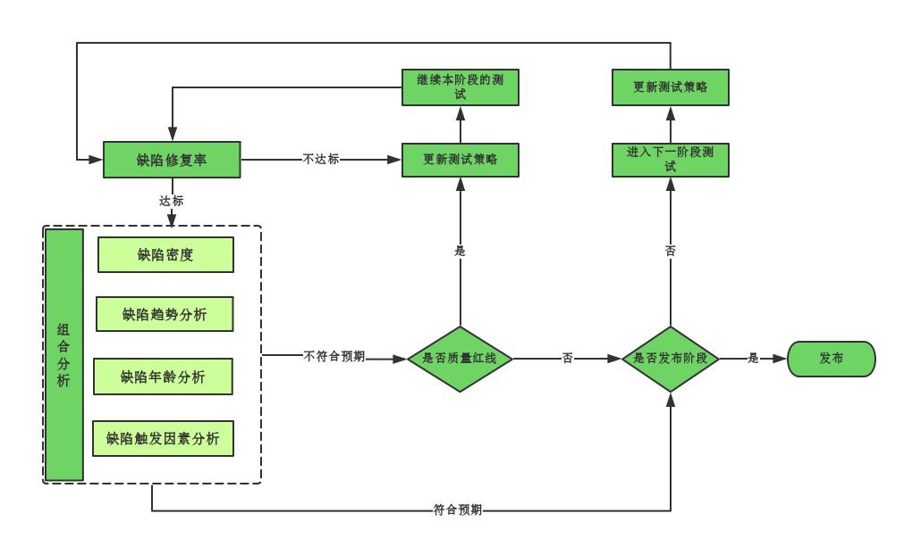

# 测试阶段缺陷分析

测试阶段缺陷分析是针对不同的测试阶段使用组合缺陷分析技术，通过分析最后给出是否能够进入下一个测试阶段的依据。需要重点关注如下问题： 
口  组合缺陷分析是否正常？  
口  阶段遗留缺陷分析是否正常？  

## 阶段组合缺陷分析

我们可以通过[组合缺陷分析](books/缺陷分析技术-组合缺陷分析.md)中介绍的方法和步骤来进行组合缺陷分析。如果组合缺陷分析的结果都是“符合预期”，我们分析的结论就应该为“可以进入下一阶段的测试或发布”，而没有异议。但如果存在缺陷分析的结果是“不符合预期”，我们通常面临两种选择:  
口  进入下一阶段的测试+更新测试策略。  
口  更新测试策略+继续本阶段的测试。  

评估结果是继续本阶段的测试、还是进入下一阶段测试，这里有一个关键性的因素，我们称之为“质量红线”，由它来决定我们的选择，在阶段质量评估中，如果是质量红线问题，即不符合预期的同时存在较为严重的问题，就应该是“更新测试策略+继续阶段的测试”，如果是一般质量目标问题即不符合预期但风险可控，就“进入下一阶段的测试”，并针对问题“更新测试策略”，在下一测试阶段解决。
如下图所示：

#### 分析思路举例：
我们从缺陷密度开始，进行组合缺陷分析。 如果我们发现实际测试过程中，缺陷密度过高，说明发现的缺陷多，是不是缺陷发现的多就不能进入下一个阶段的测试或者发布呢？这需要进行一步分析。  

我们可以再分分析一下缺陷触发因素，看看和之前相比，是否使用了更多的测试方法。如果答案是肯定的，说明有可能是因为测试投入或者测试能力提升发现了系统更隐蔽、更深入的问题。缺陷年龄分析可以进一步印证这个问题，如果是，此时应该有比较多的继承和历史遗留缺陷。如果此时缺陷趋势为收敛，并且缺陷修复率达标，则可以“进入下一阶段的测试”。如果缺陷不收敛，不建议“进入下一阶段的测试”或“发布”。  

如果缺陷触发因素和之前的测试情况无差异，说明造成缺陷密度过高，可能的原因是“产品质量不高”。如果此时缺陷年龄分析显示出系统有较多的的新需求或者需求变更，或缺陷修改引入，说明系统还存在较多未发现的缺陷风险，即使现在缺陷趋势为收敛，缺陷修复率达标，也不应该“进入下一阶段的测试”。  

如果缺陷密度过低，我们可以分析一下缺陷触发因素，如何和之前测试的情况并无差异，说明可能是系统的质量确实比较好，当然，缺陷年龄分析可以进一步印证，此时缺陷年龄分析图应该比较理想。如果缺陷此时趋势为收敛，并且缺陷修复率达标，则可以“进入下一阶段的测试”或“发布”。如果缺陷触发因素分析的结果为“有些测试方法没能发现缺陷或者发现缺陷较少”需要进一步确认原因是否是测试阻塞或是测试人员能力有问题，然后针对实际问题来制定措施。

## 阶段遗留缺陷分析

我们从[遗留缺陷分析](books/2缺陷分析技术-缺陷分析策略-遗留缺陷分析.md)中了解到，遗留缺陷是指发布时不准备修复的缺陷。那么阶段遗留缺陷分析就是对当前阶段不准备修复的缺陷进行分析，这可以帮助我们评估是否可以带着这些缺陷进入下一个测试阶段。阶段遗留缺陷可以分为2部分，一部分为下一阶段解决缺陷，一部分为发布遗留缺陷。

* * *
:bell: A1812-人们通常将无法改变的事情，称之为命运。
