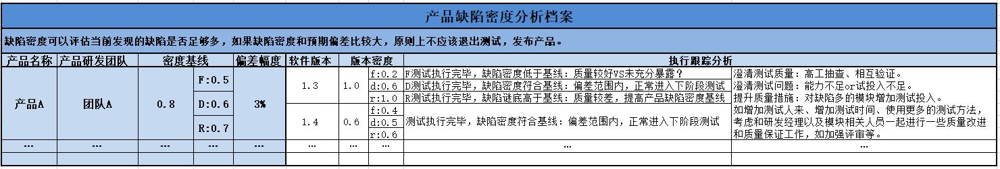

# 缺陷密度分析

## 概念&意义
缺陷密度是指每千行代码发现的缺陷数量。

对一个产品研发项目而言，确定、分析缺陷密度的重要意义在于： 
口  通过缺陷密度，我们可以预测产品中可能会有多少缺陷。 
口  通过缺陷密度，可以帮助我们评估当前已经发现的缺陷总数是否足够多。 
如果“缺陷密度”和预期偏差较大，原则上不应该退出测试，发布产品。 

## 前提条件
我们能够在产品测试之前，较为准确地预测产品的缺陷密度并将此作为一个测试目标主要基于如下假设：在系统复杂度、研发能力一定的情况下，由各个环节引入系统中的缺陷总数也会是基本一致的。

例如产品A，截止到产品发布时一共发现了1000个缺陷。和产品A复杂度类似的产品B，由和产品A能力相似的研发团队开发，测试类似的周期，也应该发现1000个左右的缺陷。如果产品B和产品A在复杂度、研发能力上有较为明显的差别，我们也可以通过乘以些系数来对产品B的缺陷密度进行折算。当然，如果产品团队能够有专人度量这些数据，建立基线，让缺陷密度的估计变得更为准确，则更有实际意义。不过在实际项目中，真实的缺陷密度不会和估计的缺陷密度恰好相等，往往会有一定的偏差。

## 分析方法
对此，我的建议是，我们在确定缺陷密度的同时，也可以确定一个允许的偏差范围(比如3%)。只要实际的缺陷密度在这个允许的偏差范围内，我们都认为是正常的(如图所示的“实际的缺陷密度3”和“实际的缺陷密度4”); 一旦缺陷密度落到了偏差范围外，就需要我们进行分析了(如图所示的“实际的缺陷密度1”和“实际的缺陷密度2”)。

如果我们发现实际的缺陷密度值偏高(如图所示“实际的缺陷密度2”)，通常最可能的原因为：产品整体质量不高。此时，软件测试架构师可以： 
口  提高缺陷密度的预估值。 
口  对缺陷较多的地方增加测试投入，如增加测试人力、增加测试时间、使用更多的测试方法等。 
口  考虑和研发经理、开发人员、系统工程师等一起进行一些质量改进和质量保证工作，如加强评审等。 

如果我们发现实际的缺陷密度值偏低(如图所示“实际的缺陷密度1”)，通常最可的原因为： 
口  产品整体质量较好。 
口  测试能力不足，未能充分暴露缺陷。 
口  测试投入不足，未能充分暴露缺陷。 
如果是第一种情况，实际的缺陷密度值较低，我们可以认为是正常情况。如果是后面两种情况，软件测试架构师可以采取增加测试投入、在测试团队中引入更有效的测试方法等措施来解决相关的问题。

## 建立产品缺陷密度分析档案
基于“前提条件”里的假设我们可以给一个产品构建缺陷密度档案，统计缺陷数据，建立缺陷密度基线，并不断的调整优化，使得缺陷密度评估更加准确。

* * *
:bell:A1812-英雄迟暮远比美人白首来的悲切-见龙卸甲。
