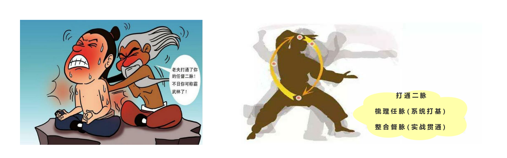

# 一夫当关的软件测试架构师

虽然目前国内很多软件公司已经设置了“软件测试架构师”这个职位，但是总的来说“软件测试架构师”这个角色现在还不够普遍。“软件测试架构师”是“软件测试工程师”在软件测试技术上一个重要的发展方向(阶段)。

对于产品测试人员来说，无论是传统的瀑布开发模式，还是选代、敏捷开发模式，测试活动都可以概括为测试需求分析、测试分析设计、测试执行和测试质量评估。产品测试不应该是产品研发末端的活动，而应该是“端到端”的，在产品研发的开始阶段，测试就开始投入，和“好的产品是设计出来的”一样，好的测试分析意义重大，测试分析不仅能够帮助测试人员更好地认识产品，提前准备好测试数据，还能反过来帮助开发人员确认需求，确认产品在非功能属性(如性能、可靠性、易用性等)方面的设计。测试的意义，不仅在于通过测试发现bug，为产品发布提供信心，还在于缺陷预防，切实提升产品质量。

作为测试团队的技术领头人，软件测试架构师在整个“端到端”的产品测试活动中，需要重点关注但不限于以下几个方面。

口 [软件测试架构师在需求分析中](books/软件测试架构师-测试架构师在需求分析中.md)

口 [软件测试架构师在测试分析和测试设计中](books/软件测试架构师-测试架构师在测试分析和测试设计中.md)

口 [软件测试架构师在测试执行中](books/软件测试架构师-测试架构师在测试执行中.md)

口 [软件测试架构师在测试质量评估中](books/软件测试架构师-测试架构师在测试质量评估中.md)

口 [软件测试架构师VS软件测试经理](books/软件测试架构师-测试架构师VS测试经理.md)

口 [软件测试架构师VS系统架构师](books/软件测试架构师-测试架构师VS系统架构师.md)

口 [像测试架构师一样去思考](books/软件测试架构师-像测试架构师一样去思考.md)

* * *

:bell: A1808-非主流和中流砥柱不一样，虽然都是少数，一个细弱偏安一个气魄担当。
