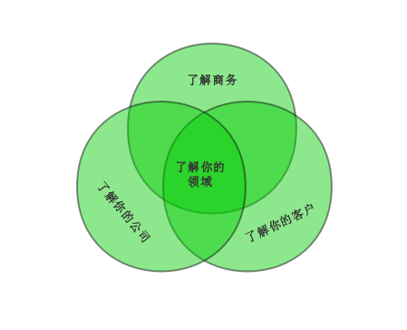

## 测试架构师在需求分析中

和研发一样，测试的源头也是需求。软件测试架构师在需求阶段，需要重点完成的工作是： 
口  理解需求。 
口  制定一份总体测试策略——明确测试范围、测试目标、测试重点和难点、测试深度和广度。 
注意，此时测试架构师不应该陷入产品的实现细节中去，这时正确的方向和清晰的目标比细节更重要。

如何才算“理解需求”呢？ 
口  参与每一场需求的讨论？ 
口  熟读每一条需求规格？ 
这样就够了吗？ 
需要特别提醒的是，此时花一些时间来理解产品的商业目标，梳理用户的使用场景，往往会为后面的工作带来事半功倍的效果。

### 1.理解产品的商业目标

产品的商业目标是测试架构师需要理解的首要问题。理解产品的商业目标的重要性在于，从产品层面来说，只要产品不能满足商业需求，即便产品使用的是最先进的开发技术，即便产品没有一个缺陷，也是无用的，不能称其为成功的产品。

Dave Hendrichson 在他的著作12 Essental Skill for sofnware Archirects (《软件架构师的12项修炼》张菲译，机械工业出版社出版)中提出“系统架构师在考虑构想软件架构的真正价值时，不能只是关注系统构造的技术方面，更要对客户价值和商务价值有深刻的认识一你能帮助客户真正解决怎样的问题？你怎样帮助公司赚钱？。这点对于软件测试架构师来说同样适用。

在这本书中，Dave Hendrichson 用了一个气泡形象地概括了商务知识和软件架构的交错关系，如图所示：

和系统架构师一样，测试架构师同样需要理解下述问题： 
口  公司中的营销和销售人员如何细分客户？ 
口  每个细分市场的关键价值主张是什么？ 
口  公司试图增长哪些细分市场？如何增长？ 
口  每个市场是谁做出购买决策的？ 
口  每个细分市场的主要竞争对手是谁？ 
口  公司对此产品的策略主张是什么？所在的产品是如何融入这一战略的？ 

并能够围绕下述内容展开测试活动: 
口  如何验证待测试的产品正确体现了市场价值？ 
口  所做的测试策略是否和公司的财务、销售、营销目标一致？ 

当软件测试架构师对这些内容进行深入思考，并通过沟通交流和决策者、系统架构师、市场等角色达成一致，统一目标时，测试很自然地就能融入其中，成为公司的伙伴，而不是阻碍软件按时发布的“拦路虎”。测试也能更容易获得决策者和产品开发的认可，测试的深度、广度会更透明，利于测试更好地把握测试进度，而不是总被压缩测试时间来换取项目进度的零偏差。(很多时候都存在压缩测试时间来保证项目进度的问题，其中很大一部分的原因是决策者根本不认可测试的内容和方法，认为测试过度或者冗余过多，并没有准确评估测试真正的工作量)。

### 2.梳理用户的使用场景

梳理用户的使用场景是软件测试架构师在这阶段需要重点关注的另外一项内容。

所谓“用户的使用场景”，简单来说，就是指用户将会如何使用这个产品。用户场景将直接体现产品的价值。因此，在测试之前，了解你的用户至关重要: 
口  产品有多少种类型的用户，这些用户的业务又是什么，他们如何从你的产品中获得价值(比如通过你的产品赚钱，获得某种资源)？ 
口  产品的竞争对手对用户提供了哪些有价值的解决方案？你们之间的差异是什么？ 
口  产品所在领域有哪些基本的规范和要求，行业背景有哪些，用户的习惯是什么(如完成各种活动的顺序、对活动完成的判断标准和可能的重要决定等)？ 

然后软件测试架构师需要把梳理的用户使用场景，归纳为测试场景: 
口  针对不同类型的用户，分别确定这些用户的行为习惯和关注点。 
口  逐一分析这些用户会如何使用产品，根据分析结果建立产品的拓扑模型、配置模型和流量模型等，抽象出典型场景。 
口  确定各个典型场景下的输入和输出(包括正常输入和异常输入、攻击，还需要考虑模拟测试的时间长短，等等) 

对测试场景的分析，也可以放在测试分析和设计阶段进行。这部分的输出将会成为验收测试时的重要输入。

### 3.输出产品总体测试策略

输出产品总体测试策略是软件测试架构师在这一阶段的重要输出。

它的作用，就好像测试的总纲，帮助整个测试团队明确测试的范围、目标，测试的重点和难点，测试的深度和广度，以及如何安排各种测试活动(及测试分层)。

测试重点和测试难点是完全不同的两个概念。
测试重点是由产品价值、质量目标、产品实现(新写代码、开源代码或是继承代码)和历史测试情况(主要针对继承类产品)等多项因素综合决定的。“测试难点”是从测试技术的角度来说的，是对产品测试验证难易程度的分析。

测试深度和测试广度也有所不同。
测试广度是从覆盖的角度来对产品测试进行描述而测试深度是从测试方法(如单运行测试、多运行测试、边界值或错误输入等)来对测试进行描述。

当我们对每个特性确定了测试重点和测试难点、测试深度和测试广度之后，测试的总体思路也就随之明确了。后面的自动化策略、探索测试策略、测试分析和设计的策略也变得明确了。

测试分层帮我们将一个大的测试目标分解为若干小的测试目标。
这样我们可以逐层测试，逐层评估测试结果，并根据测试结果不断修正测试策略，不仅让测试目标变得可以达到，还让整个测试过程变得可控。

上述内容构成了测试的整体框架。我们可以在这个框架下不断细化，再输出阶段测试策略和版本测试策略等。如果把测试需求分析、测试分析设计、测试执行、测试质量评估等测试活动比作珍珠，测试策略就是那根穿珍珠的线，贯穿始终。

* * *
